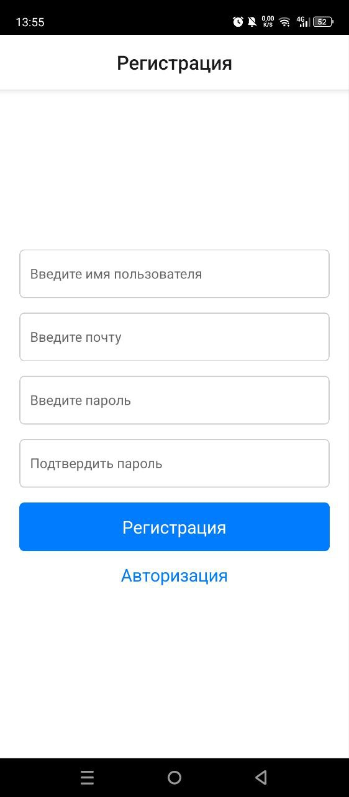

# Tasks/Groups
1. Авторизация  
- Вы можете войти в аккаунт если уже пользовались приложением 
2. Регистрация 
- Если у вас нету данных для входа вы можете зарегистрироваться заполнив поля, которые показаны на фотографии 
3. Задания
- Вы можете быть владельцем задания и исполняющим
- Это вы увидите на карточке задания слева владелец справа исполнитель
- Владелец задания проверяет задания и может принять,вернуть и отклонить.
- Если задание истекло срок то оно становится просроченным
- Цвета и их значения 
 *     голубой - в процессе 
 *     желтоватый - отправлен на проверку
 *     темно-синий - возвращен на доработку
 *     красный - отклонен
 *     темно-серый - просрочен
 *     зеленый - выполнен
4. Группы 
- Вы можете создать группу справа сверху
- После создания группы  вы можете добавить пользователей, нажав на кнопку участники
- Также владелец группы может давать задание себе или конкретному пользователю который есть в группе. Для этого надо нажать на группу
5. Настройки 
- Вы можете посмотреть архив заданий
- Вы можете посмотреть информацию о приложении
- Вы можете выйти из аккаунта

